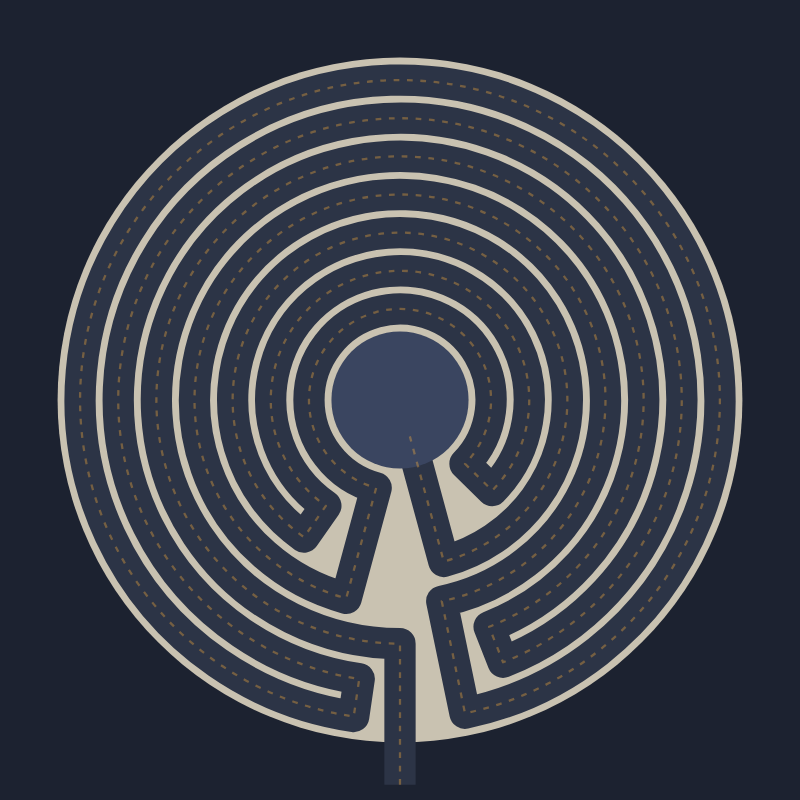

# Labyrinth-Maker

Draw a labyrinth right in your browser: the classical Cretan labyrinth, an 11-circuit Troy Town, or your own design, described by the order in which its path visits the rings. Then walk it to the center, and save it as an SVG or a PNG. No sign-up and no libraries.

- [Draw a labyrinth](https://evoluteur.github.io/labyrinth-maker/)

## What it does

A labyrinth is not a maze: it has a single path, with no choices, and the path always leads to the center. (For mazes, with branches and dead ends, see [Maze-Maker](https://github.com/evoluteur/maze-maker).)

- **Designs**: Cretan (7 circuits), Troy Town (11), the Chartres circuit order (11) drawn on one axis, a simple serpentine and the Cretan walked backwards.
- **Path sequence**: type the circuits in the order you walk them, 1 being the outermost (the Cretan labyrinth is 3 2 1 4 7 6 5), and the labyrinth draws itself. If the walls would cross, the page says which turns clash. **Surprise me** picks a random valid sequence.
- **Walk it**: a walker follows the path to the center at the pace you choose.
- **Look**: five color schemes (stone, turf, sand, ink, night), wall thickness, a dotted walking line and circuit numbers.
- **Save**: **Download PNG** (2000 pixels square) or **Download SVG**.

## How the drawing works

Every circuit goes almost all the way around, and the path turns into the next circuit next to the axis, alternately on the right and on the left of it. On each side, the turns have to nest inside each other like brackets, or the walls would cross; that is the whole rule, and the page checks it. The walls are what is left of a disk once the path is carved out of it.

## How it is built

The pages are plain HTML, CSS and JavaScript, with no dependencies and no build step. Just open `index.html`. It is also a small installable web app: add it to your home screen or desktop and it works offline.

- The labyrinth is one SVG, and all the geometry and the app logic are in [js/labyrinth.js](https://github.com/evoluteur/labyrinth-maker/blob/main/js/labyrinth.js).
- Three color themes (dark, light and blue) are shared with my other projects.
- Your settings are kept in the browser's local storage.

Labyrinth-Maker is open source at [GitHub](https://github.com/evoluteur/labyrinth-maker) with MIT license.

Had fun browsing the app? [Buy me a coffee by becoming a sponsor](https://github.com/sponsors/evoluteur).

You may also be interested in [Maze-Maker](https://github.com/evoluteur/maze-maker) ([demo](https://evoluteur.github.io/maze-maker/)), and in my other sacred geometry projects [Mandala-Maker](https://github.com/evoluteur/mandala-maker) ([demo](https://evoluteur.github.io/mandala-maker/)), [Harmonograph-Maker](https://github.com/evoluteur/harmonograph-maker) ([demo](https://evoluteur.github.io/harmonograph-maker/)) and [Sacred-Geometry](https://github.com/evoluteur/sacred-geometry) ([demo](https://evoluteur.github.io/sacred-geometry/)). For more mystic arts as small web apps, see [Esoterica](https://evoluteur.github.io/esoterica.html).

Copyright (c) 2026 [Olivier Giulieri](https://evoluteur.github.io/).
